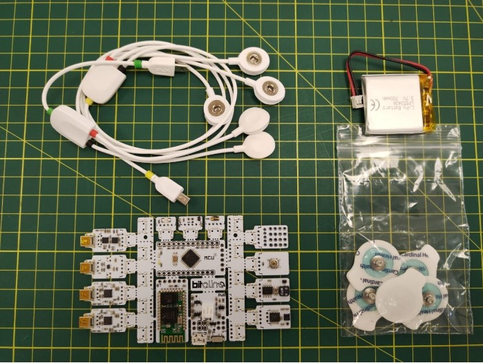
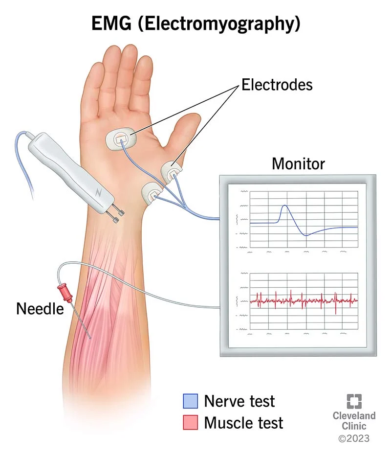
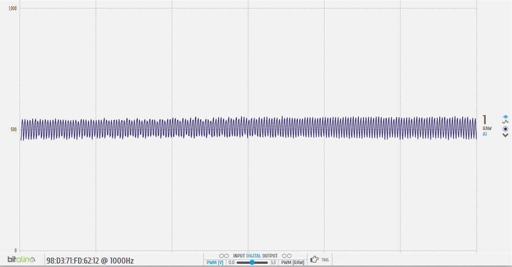
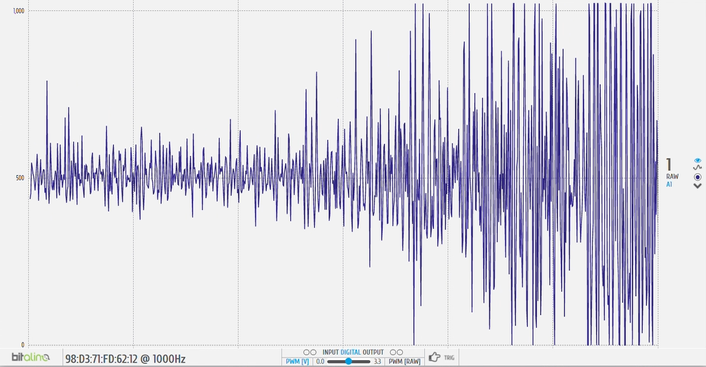
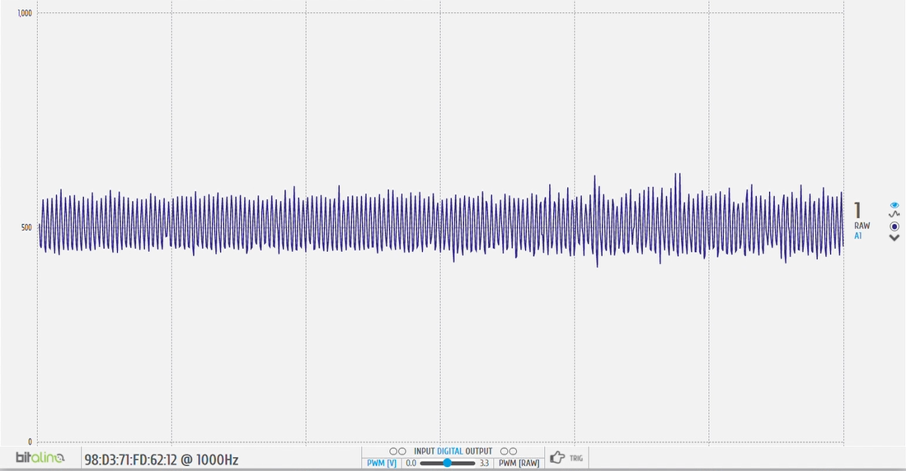
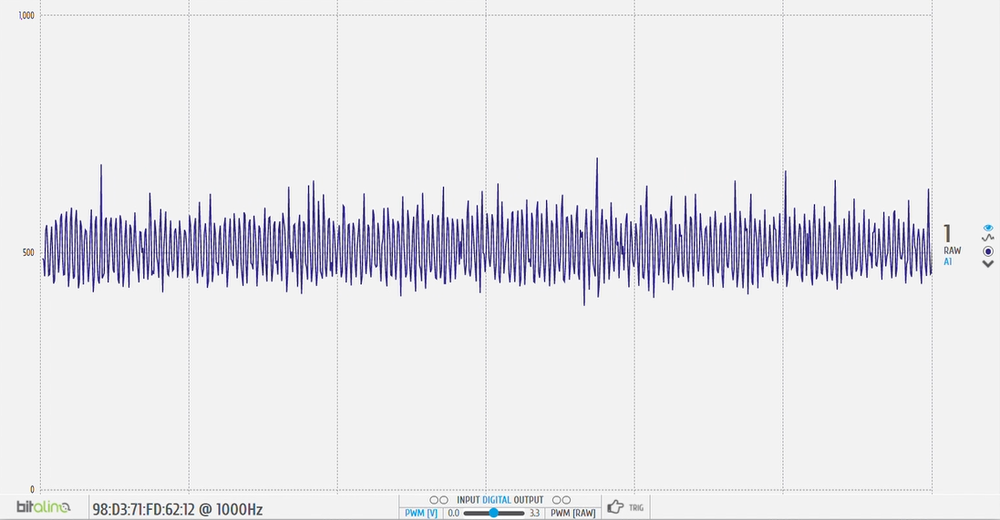

# Laboratorio 3
------------
## Tabla de contenidos
- [Objetivos](#Objetivos)
- [BITalino](#BITalino-(Conceptos))
- [¿Qué es EMG?](#¿Qué-es-EMG)
- [Ejercicio 1 (Músculo Biceps)](#Ejercicio-1-(Músculo-Biceps))
- [Ejercicio 2 (Músculo Gastrocnemio)](#Ejercicio-2-(Músculo-Gastrocnemio))
- [Referencias](#Referencias)

  
## Objetivos:
  - Adquirir señales biomédicas de EMG y ECG.  
  - Hacer una correcta configuración de BiTalino.  
  - Extraer la información de las señales EMG y ECG del software OpenSignals (r)evolution.  
  
## BITalino:
BITalino es un módulo "todo en uno", considerado como placa de desarrollo de adquisición de datos biomédicos de bajo costo, que permite la realización de proyectos mediante herramientas, sin necesidad de tener conocimientos electrónicos con respecto a bioseñales. [][]  
Como se observa en la imagen, los sensores que lo componen consta de electromiografía (EMG), encefalografía (EEG), electrocardiografía (ECG), actividad electrodérmica (EDA), acelerómetro (ACC) y luz (LUX). Estos son algunos de sus "bloques" extraíbles, junto con un microcontrolador ATMega328, el mismo que el de Arduino, con una frecuencia de muestreo configurable hasta 1000 Hz. Posee la capacidad de admitir 6 entradas de tipo analógico (4 de 10 bits, y 2 de 6 bits), 4 entradas digitales y 4 salidas digitales. Asimismo, se encuentra equipado con comunicación Bluetooth y/o Bluetooth Low Energy (BLE) y conectores UC-E6.  

   
  
## ¿Qué es EMG?
Electromiografía es un registro extracelular de la actividad bioeléctrica en respuesta a la estimulación nerviosa del músculo, principalmente para la evaluación de músculos y sus correspondientes células nerviosas que los controlan. [][] Para ello, su método de adquisición de estas señales se dan a través de pequeñas agujas o electrodos a través de la piel hacia el músculo, estos pueden ser superficiales o intramusculares, pudiendo registrar así la actividad eléctrica del músculo en cuestión.  
EMG logra realizar la medición en tres periodos de tiempo: reposo, contracción leve y contracción forzada (estado activo). Inicialmente, se mide cuando el músculo no produce señal alguna, más que un breve periodo inicial de actividad.  Luego, las neuronas motoras transmiten señales eléctricas generando la contracción del músculo. [] En un primer instante de tiempo, se le pide al sujeto que contraiga el músculo sea levantando o doblando alguna extremidad. Lo cual crea que el potencial de acción, junto con su amplitud y forma de onda, informe sobre su capacidad de respuesta ante estímulos nerviosos. A medida que transcurre el tiempo, y se aplica mayor fuerza, aumenta la contracción muscular, consiguiendo activar más fibras musculares, y, por ende, potenciales de acción. []  
  
   
  
## Ejercicio 1 (Músculo Biceps): 
- Imágenes y videos CONEXIÓN USADA 
- Video de señal en silencio eléctrico o reposo 
- Ploteo de señal en OpenSignals 
  
- Resumen y explicación de señal (2)  
Como primer ejercicio, se realizó una medición de EMG en el músculo bíceps braquial del miembro superior izquierdo. Se realizaron 3 tipos de mediciones: Brazo en reposo, brazo en movimiento de flexión y brazo en movimiento de extensión.  
En la primera medición, el brazo permaneció en reposo encima de una mesa con la finalidad de que los músculos del usuario estén relajados. Esto se representa como un señal constante y pequeña en la gráfica obtenida que viene a ser ruido ya que no hay una actividad eléctrica presente en el músculo. El ruido puede provenir de distintas fuentes como el ruido inherente de fuentes eléctricas, ruido del medio ambiente, movimiento involuntario del usuario, un mal contacto entre el electrodo y la piel, entre otros [].   
https://www.ijsrp.org/research-paper-0517.php?rp=P656368   
  
Señal obtenida cuando el músculo está en reposo:  
   
  
En la segunda medición, el brazo realiza una flexión de forma gradual y con una cierta fuerza que va aumentando de intensidad a medida que va realizándose el movimiento. En la gráfica obtenida muestra como las amplitudes van aumentando hasta llegar a unos picos altos debido a que al final del movimiento se le pide al usuario que aplique toda la fuerza posible.   
  
Señal obtenida del ejercicio de flexión cuando comienza el movimiento:  
   
  
Señal obtenida del ejercicio de flexión cuando se ejerce la máxima fuerza:  
   
  
En la tercera medición se tiene un procedimiento y resultado parecido, el brazo realiza una extensión de forma continua y constante. Para ello empieza ejerciendo una fuerza pequeña hasta alcanzar la máxima intensidad posible. La gráfica EMG muestra cómo el tamaño de la señal va aumentando ligeramente hasta llegar a unos picos altos; sin embargo, se puede observar que la amplitud máxima obtenida es mucho menor a la alcanzada en la segunda medición.   
  
Señal obtenida del ejercicio de extensión cuando comienza el movimiento:  
   
  
Señal obtenida del ejercicio de extensión cuando se ejerce la máxima fuerza:  
   
  
Esta diferencia de resultados es debido a la función que cumple ciertas regiones del músculo al realizar un movimiento. La zona evaluada es el bíceps braquial, este músculo está activo durante la flexión ya que se contrae. Cuando se realiza una flexión, el bíceps braquial contribuye mediante una contracción, lo que significa que se genera una alta actividad muscular representándose como la detección de una alta actividad eléctrica dependiente de la intensidad a lo largo del tiempo. En una extensión sucede lo contrario, el tríceps braquial es el músculo que realiza una mayor actividad muscular mientras que el bíceps tenderá a relajarse generando una menor actividad eléctrica en todo el proceso [b].
https://www.ncbi.nlm.nih.gov/pmc/articles/PMC7500348/

- ### Archivo de datos de señal (pon en repositorio)
- ### Ploteo de señal en Python (una breve descripción de de que se ve en la señal)  
Como se mencionón anteriormente, la primera señal medida fue la del músculo del bíceps. En esta primera imagen se puede observar la gráfica completa medida en nuestro compañero, la cual tiene una duración de aproximadamente 600 segundos, por tal motivo hay algunos valores que se encuentran superior a 1000 Hz (Frecuencia de sampleo); sin embargo, estas mediadas son productos de movimeintos ajenos a la experiencia, por tal motivo no se toma en cuenta.  
   

Se presenta las gráficas de extensión, con una fuerza en contra del movimiento realizado Esta es la gráfica de la flexión del brazo, la cual tuvo una duración de 1 segundo: 
   

A continuación se muestra su gráfica FFT en decibelios: 
   

Esta gráfica representa la extensión del brazo, la cual tuvo una duración de 5 segundos  
  
A continuación se muestra su gráfica FFT en decibelios: 
    

## Observaciones:  

Se observa en la de señal EMG captada por el BiTalino una distorisión en representado en la frecuencia de la actividad eléctrica del músculo del Biceps una distorción que en los casos puede deberse a que el usuario poseía en el momento de la toma de muestra una cadena de plata por lo que los electrodos de EMG captan un voltaje en la membrana de la células epiteliales distorcionados por el elemento métalico ubicado en su cuello, lo que se distorciona y se evidencia en el gráfico de las freccuencias.     

## Ejercicio 2 (Músculo Gastrocnemio):
- ### Imagenes y Videos CONEXIÓN USADA
- ### Video de señal en silencio eléctrico o reposo 
- ### Ploteo de señal en OpenSignals 
- ### Resumen y explicación de señal (4)

La señal captada del gastrocnemio, a nivel basal, fue menos notoria que la del bícep braquial. No obstante, vale resaltar que esta región anatómica presentaba una mayor concentración de vello corporal lo cual puede perjudicar la captación de la señal EMG. Al momento de flexionar la extremidad del miembro inferior, notamos cambios en la amplitud de la señal captada. La amplitud, en efecto, fue mayor cuando se utilizó más fuerza para superar la resistencia infligida contra el movimiento de la pierna. Finalmente, la posición del suijeto de prueba pudo afectar la fidelidad de la señal EMG dado que la dispoción de electrodos y el BITalino dificultaron conseguir una posición totalmente en reposo. 
     

- ### Archivo de datos de señal (pon en repositorio)
- ### Ploteo de señal en Python
La segunda medición de EMG fue realizada en el músculo gastrocnemio, localizado en en plano superficial de la parte posterior de la pierna. AL igual que el caso anterior, se realizó una medición general, donde se encunetran la flexión y la extensión de la pierna para medir la actividad del músculo en cuestión, obteniendo así la siguiente gráfica: 
   

## Observaciones: 
Como ya hemos mencionado previamente, BITalino es un dispositivo compuesto por varios módulos individuales, entre los cuales se encuentra el EMG. Al analizar la señal captada, se ha detectado la presencia de ruido en la misma, lo cual puede deberse a diversos factores, tales como el ruido ambiental y las condiciones de preparación de la piel del sujeto. En este caso en particular, es importante destacar que el participante presentaba una cantidad significativa de vello en la pierna, lo que probablemente haya sido la causa del ruido observado en la señal, en contraposición con la medición realizada en el brazo, el cual no contaba con vello.

## Referencias
- 
