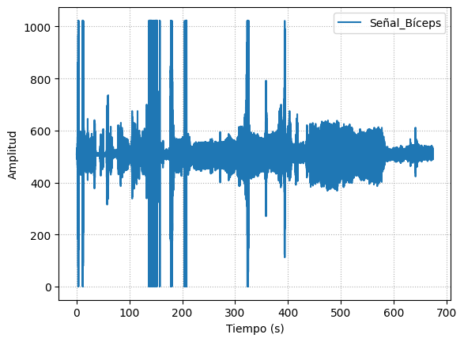
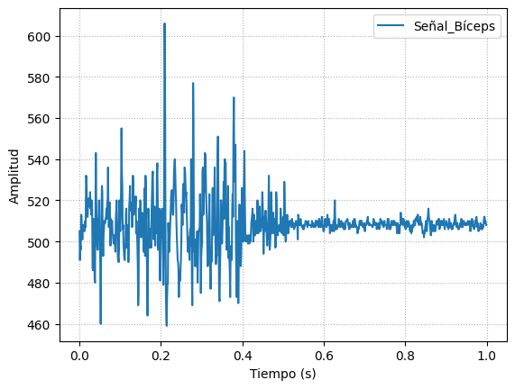
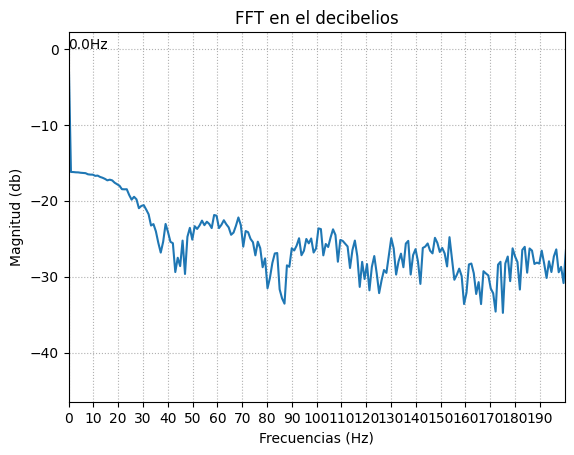
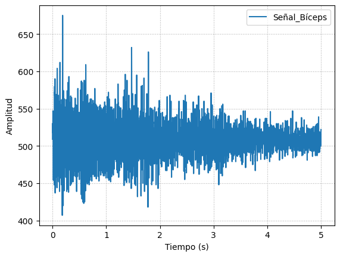
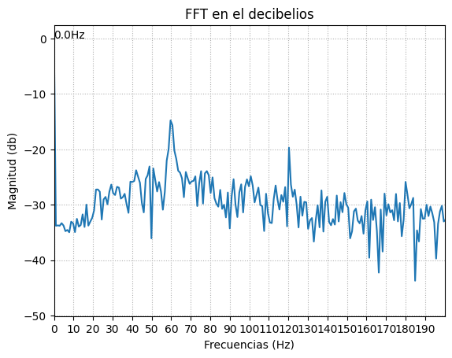

# Laboratorio 3
------------
## Tabla de contenidos
- [¿Qué es EMG?](#¿Qué-es-EMG)
- [BITalino (Conceptos)](#BITalino-(Conceptos))
- [Ejercicio 1 Músculo Biceps](#Ejercicio-1-Músculo-Biceps)
- [Ejercicio 2 Músculo](#Ejercicio-2-Músculo)

## ¿Qué es EMG? (nicolle)
Breve descripción de EMG con imágenes

## BITalino (Conceptos) (nicolle)
Descripción de sus componentes y conexiones

## Ejercicio 1 Músculo Biceps 
- Imágenes y videos CONEXIÓN USADA 
- Video de señal en silencio eléctrico o reposo 
- Ploteo de señal en OpenSignals 
- Resumen y explicación de señal (2)  
Como primer ejercicio, se realizó una medición de EMG en el músculo bíceps braquial del miembro superior izquierdo. Se realizaron 3 tipos de mediciones: Brazo en reposo, brazo en movimiento de flexión y brazo en movimiento de extensión.  
En la primera medición, el brazo permaneció en reposo encima de una mesa con la finalidad de que los músculos del usuario estén relajados. Esto se representa como un señal constante y pequeña en la gráfica obtenida que viene a ser ruido ya que no hay una actividad eléctrica presente en el músculo. El ruido puede provenir de distintas fuentes como el ruido inherente de fuentes eléctricas, ruido del medio ambiente, movimiento involuntario del usuario, un mal contacto entre el electrodo y la piel, entre otros [a].  
https://www.ijsrp.org/research-paper-0517.php?rp=P656368  
En la segunda medición, el brazo realiza una flexión de forma gradual y con una cierta fuerza que va aumentando de intensidad a medida que va realizándose el movimiento. En la gráfica obtenida se puede observar como las amplitudes van aumentando hasta llegar a unos picos altos debido a que al final del movimiento se le pide al usuario que realice la máxima contracción posible.

- ### Archivo de datos de señal (pon en repositorio)
- ### Ploteo de señal en Python (una breve descripción de de que se ve en la señal)  
En este presente trabajo se presenterá las gráficas de los datos obtenidos durante la experiencia del laboratorio del día de hoy.
Como se mencionón anteriormente, la primera señal medida fue la del músculo del bíceps.
  

En esta primera imagen se puede observar la gráfica completa medida en nuestro compañer, la cual tiene una duración de aproximadamente 600 segundos, por tal motivo hay algunos valores que se encuentran superior a 1000 Hz (Frecuencia de sampleo); sin embargo, estas mediadas son productos de movimeintos ajenos a la experiencia, por tal motivo no se toma en cuenta.  
Se presenta las gráficas de extensión y flexión, con una fuerza en contyra del movimiento realizado: 
  
A continuación se muestra su gráfica FFt en decibelios: 
  
Esta es la gráfica de la flexión del brazo, la cual tuvo una duración de 1 segundo.   
Esta gráfica representa la extensión del brazo, la cual tuvo una duración de 5 segundos  
A continuación se muestra su gráfica FFt en decibelios: 
  

JUSTIFICAR RUIDO POR CADENA METÁLICA (3)   

Se observa en la de señal EMG captada por el BiTalino una distorisión en representado en la frecuencia de la actividad eléctrica del músculo del Biceps una distorción que en los casos puede deberse a que el usuario poseía en el momento de la toma de muestra una cadena de plata por lo que los electrodos de EMG captan un voltaje en la membrana de la células epiteliales distorcionados por el elemento métalico ubicado en su cuello, lo que se distorciona y se evidencia en el gráfico de las freccuencias.     

## Ejercicio 2 Músculo 
- Imagenes y Videos CONEXIÓN USADA
- Video de señal en silencio eléctrico o reposo 
- Ploteo de señal en OpenSignals 
- Resumen y explicación de señal (4)
- Archivo de datos de señal (pon en repositorio)
- Ploteo de señal en Python (una breve descripción de de que se ve en la señal) (6)

JUSTIFICAR VA A HABER CIERTO ALGO POR TENER VELLOS EN LA PIERNA: Como ya hemos mencionado previamente, BITalino es un dispositivo compuesto por varios módulos individuales, entre los cuales se encuentra el EMG. Al analizar la señal captada, se ha detectado la presencia de ruido en la misma, lo cual puede deberse a diversos factores, tales como el ruido ambiental y las condiciones de preparación de la piel del sujeto. En este caso en particular, es importante destacar que el participante presentaba una cantidad significativa de vello en la pierna, lo que probablemente haya sido la causa del ruido observado en la señal, en contraposición con la medición realizada en el brazo, el cual no contaba con vello.

