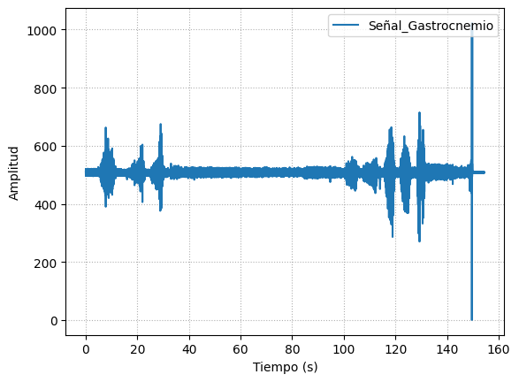

# Laboratorio 3
------------
## Tabla de contenidos
- [Objetivos del laboratorio](#objetivos-del-laboratorio)
- [¿Qué es EMG?](#¿Qué-es-EMG)
- [BITalino (Conceptos)](#BITalino-(Conceptos))
- [Ejercicio 1 Músculo Biceps](#Ejercicio-1-Músculo-Biceps)
- [Ejercicio 2 Músculo](#Ejercicio-2-Músculo)
- [Referencias](#Referencias)

  
## Objetivos del laboratorio:
  - Adquirir señales biomédicas de EMG y ECG.
  - Hacer una correcta configuración de BiTalino.
  - Extraer la información de las señales EMG y ECG del software OpenSignals (r)evolutio
  
## ¿Qué es EMG? (nicolle)
Electromiografía es un registro extracelular de la actividad bioeléctrica en respuesta a la estimulación nerviosa del músculo, principalmente para la evaluación de músculos y sus correspondientes células nerviosas que los controlan. [1][2] Para ello, su método de adquisición de estas señales se dan a través de pequeñas agujas o electrodos a través de la piel hacia el músculo, estos pueden ser superficiales o intramusculares, pudiendo registrar así la actividad eléctrica del músculo en cuestión.  
EMG logra realizar la medición en tres periodos de tiempo: reposo, contracción leve y contracción forzada (estado activo). [1] Inicialmente, se mide cuando el músculo no produce señal alguna, más que un breve periodo inicial de actividad.  Luego, las neuronas motoras transmiten señales eléctricas generando la contracción del músculo. [2] En un primer instante de tiempo, se le pide al sujeto que contraiga el músculo sea levantando o doblando alguna extremidad. Lo cual crea que el potencial de acción, junto con su amplitud y forma de onda, informe sobre su capacidad de respuesta ante estímulos nerviosos. A medida que transcurre el tiempo, y se aplica mayor fuerza, aumenta la contracción muscular, consiguiendo activar más fibras musculares, y, por ende, potenciales de acción. [1] 

## BITalino (Conceptos) (nicolle)
Descripción de sus componentes y conexiones

## Ejercicio 1 Músculo Biceps 
- Imágenes y videos CONEXIÓN USADA 
- Video de señal en silencio eléctrico o reposo 
- Ploteo de señal en OpenSignals 
- Resumen y explicación de señal (2)  
Como primer ejercicio, se realizó una medición de EMG en el músculo bíceps braquial del miembro superior izquierdo. Se realizaron 3 tipos de mediciones: Brazo en reposo, brazo en movimiento de flexión y brazo en movimiento de extensión.  
En la primera medición, el brazo permaneció en reposo encima de una mesa con la finalidad de que los músculos del usuario estén relajados. Esto se representa como un señal constante y pequeña en la gráfica obtenida que viene a ser ruido ya que no hay una actividad eléctrica presente en el músculo. El ruido puede provenir de distintas fuentes como el ruido inherente de fuentes eléctricas, ruido del medio ambiente, movimiento involuntario del usuario, un mal contacto entre el electrodo y la piel, entre otros [a].  
https://www.ijsrp.org/research-paper-0517.php?rp=P656368  
En la segunda medición, el brazo realiza una flexión de forma gradual y con una cierta fuerza que va aumentando de intensidad a medida que va realizándose el movimiento. En la gráfica obtenida se puede observar como las amplitudes van aumentando hasta llegar a unos picos altos debido a que al final del movimiento se le pide al usuario que realice la máxima contracción posible.

- ### Archivo de datos de señal (pon en repositorio)
- ### Ploteo de señal en Python (una breve descripción de de que se ve en la señal)  
Como se mencionón anteriormente, la primera señal medida fue la del músculo del bíceps. En esta primera imagen se puede observar la gráfica completa medida en nuestro compañero, la cual tiene una duración de aproximadamente 600 segundos, por tal motivo hay algunos valores que se encuentran superior a 1000 Hz (Frecuencia de sampleo); sin embargo, estas mediadas son productos de movimeintos ajenos a la experiencia, por tal motivo no se toma en cuenta.  
   

Se presenta la gráfica de extensión, con una fuerza en contra del movimiento realizado, la cual tuvo una duración de 1 segundo: 
   

A continuación se muestra su gráfica FFT en decibelios: 
   

Esta gráfica representa la flexión del brazo, la cual tuvo una duración de 5 segundos. Mencionar que igual que el caso anterior, tivo una fuerza en contra de su movimeinto:  
  
A continuación se muestra su gráfica FFT en decibelios: 
    

JUSTIFICAR RUIDO POR CADENA METÁLICA (3)   

Se observa en la de señal EMG captada por el BiTalino una distorisión en representado en la frecuencia de la actividad eléctrica del músculo del Biceps una distorción que en los casos puede deberse a que el usuario poseía en el momento de la toma de muestra una cadena de plata por lo que los electrodos de EMG captan un voltaje en la membrana de la células epiteliales distorcionados por el elemento métalico ubicado en su cuello, lo que se distorciona y se evidencia en el gráfico de las freccuencias.     

## Ejercicio 2 Músculo Gastrocnemio
- ### Imagenes y Videos CONEXIÓN USADA
- ### Video de señal en silencio eléctrico o reposo 
- ### Ploteo de señal en OpenSignals 
- ### Resumen y explicación de señal (4)
- ### Archivo de datos de señal (pon en repositorio)
- ### Ploteo de señal en Python (una breve descripción de de que se ve en la señal) (6)
La segunda medición de EMG fue realizada en el músculo gastrocnemio, localizado en en plano superficial de la parte posterior de la pierna. AL igual que el caso anterior, se reliazó una medición general, donde se encunetran la flexión y la extensión de la pierna para medir la actividad del músculo en cuestión, obteniendo así la siguiente gráfica. Mencioar que los movimientos realizados fueron hechos con una fuerza que iba en contra del movimeiento: 
   

De la gráfica anteior se extrae la gráfica de extensión. Esta es la gráfica de la flexión del brazo, la cual tuvo una duración de 3.5 segundo: 
   

De la misma forma se muestra su gráfica FFT en decibelios: 
   

Así mismo, esta gráfica representa la flexión del brazo, la cual tuvo una duración de 2 segundos:  
  

Ahora se muestra su gráfica FFT en decibelios: 
    

JUSTIFICAR VA A HABER CIERTO ALGO POR TENER VELLOS EN LA PIERNA: Como ya hemos mencionado previamente, BITalino es un dispositivo compuesto por varios módulos individuales, entre los cuales se encuentra el EMG. Al analizar la señal captada, se ha detectado la presencia de ruido en la misma, lo cual puede deberse a diversos factores, tales como el ruido ambiental y las condiciones de preparación de la piel del sujeto. En este caso en particular, es importante destacar que el participante presentaba una cantidad significativa de vello en la pierna, lo que probablemente haya sido la causa del ruido observado en la señal, en contraposición con la medición realizada en el brazo, el cual no contaba con vello.

## Referencias
[1] “Electromyography (EMG),” Hopkinsmedicine.org, Aug. 08, 2021. https://www.hopkinsmedicine.org/health/treatment-tests-and-therapies/electromyography-emg#:~:text=Electromyography%20(EMG)%20measures%20muscle%20response,the%20skin%20into%20the%20muscle. (accessed Apr. 06, 2023).
‌ 
[2] “Electromiografía - Mayo Clinic,” Mayoclinic.org, 2019. https://www.mayoclinic.org/es-es/tests-procedures/emg/about/pac-20393913 (accessed Apr. 06, 2023).
‌ 
[3] aca Giancarlo  
