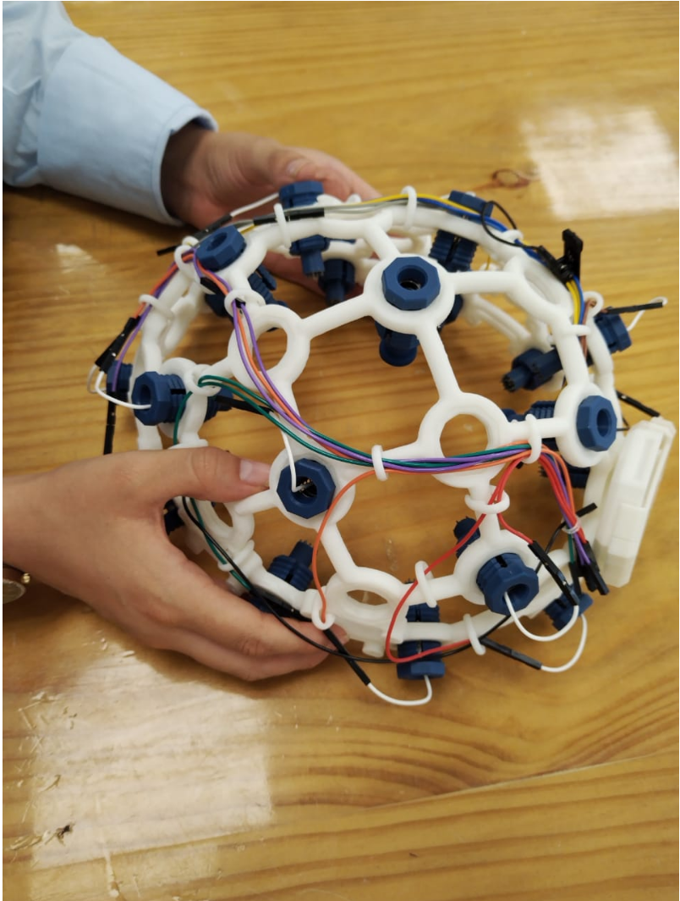

# Introducción a Señales Biomédicas Grupo 1

Repositorio del curso Introducción a Señales Biomédicas

Integrantes:   
- Luis Daniel Jesús Diaz Leguizamon (colaborador)  
- Giancarlo Arian Guarnizo Bellido (colaborador)  
- Diego Fernando Segura Contreras (colaborador)  
- Alexys Caytano Melendez (colaborador)  
- Nicolle Muñoz Huamán (colaborador)  
- Yereli Karol García Palomino (colaborador)  

## Presentacion de los integrantes:
Luis Daniel Jesús Diaz Leguizamon:  
Estudiante de 9no ciclo de la especialidad Ingenieria Biomedica PUCP-UPCH, interesado en el diseño y desarrollo de implantes neurológicos para la adquisición, almacenamiento y envío de información. 

Giancarlo Arian Guarnizo Bellido:  
Estudiante de 7mo ciclo de la carrera Ingenieria Biomedica PUCP-UPCH, interesado en la especialidad de Ingeniería Clínica y Señales e Imágenes Biomédicas. Con el curso de Introducción a señales biomédicas busca tener una base sólida en el entendimiento y procesamiento de las señales fisiológicas.

Diego Fernando Segura Contreraras:  
Estudiante de 7mo ciclo de Ingenieria Biomedica PUCP-UPCH, con interés en las concentraciones de Ingeniería Clínica e Ingeniería de Tejidos.

Yereli Karol García Palomino:  
Estudiante de 7mo ciclo de Ingeniería Biomédica PUCP-UPCH, en busca de poder desarrollar diferentes proyectos que involucren las especialidades de Ingeniera Clínica y Procesamiento señales e imágenes biomédicas.  

Nicolle Stephany Muñoz Huamán:  
Estudiante de 7mo ciclo de la carrera Ingeniería Biomédica PUCP-UPCH, inclinada a realizar proyectos sobre la carrera, y abarcar las áreas de Ingeniería Clínica y Señales e Imágenes Biomédicas. 

## Objetivo del curso:

En este curso tenemos como objetivo el realizar un proyecto de investigación en el que se adquirirá y procesará las señales biomedicas recibidas de un electroencefalograma (EEG).

## Contenido del curso a desarrollar:

UNIDAD 1: Introducción, adquisición y principios fisiológicos de las señales biomédicas  
UNIDAD 2: Análisis de ECG, EMG y EEG  
UNIDAD 3: Introducción al tratamiento digital de señales  
UNIDAD 4: Informática biomédica e introducción a la inteligencia artificial en señales biomédicas  

## Materiales a usar:

Ultracortex EEG Headset: Herramienta capaz de registrar la actividad cerebral (EEG).  

