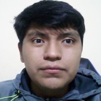

# Grupo 1 - Introducción a Señales Biomédicas 
--------------
Repositorio del curso Introducción a Señales Biomédicas del grupo 1 del ciclo 2023-1 de la Universidad Cayetano Heredia
## Tabla de contenidos:

- [Integrantes](#Integrantes)
- [Presentación de los integrantes](#Presentacion-de-los-integrantes)
- [Objetivo del curso](#Objetivo-del-curso)
- [Contenido del curso](#Contenido-del-curso)
- [Materiales a usar](#Materiales-a-usar)
- [Docentes del curso](#Docentes-del-curso)
## Integrantes:   
- Luis Daniel Jesús Diaz Leguizamon (colaborador) - luis.diaz.l@upch.pe  
- Giancarlo Arian Guarnizo Bellido (colaborador) - a20191812@pucp.edu.pe  
- Diego Fernando Segura Contreras (colaborador) - diego.segura.c@upch.pe  
- Alexys Caytano Melendez (colaborador) - alexys.caytano@upch.pe  
- Nicolle Muñoz Huamán (colaborador) - nicolle.munoz@upch.pe  
- Yereli Karol García Palomino (colaborador) - a20191706@pucp.edu.pe  

## Presentacion de los integrantes:
Luis Daniel Jesús Diaz Leguizamon:  
Estudiante de 9no ciclo de la especialidad Ingenieria Biomedica PUCP-UPCH, interesado en el diseño y desarrollo de implantes neurológicos para la adquisición, almacenamiento y envío de información.  

Giancarlo Arian Guarnizo Bellido:  
Estudiante de 7mo ciclo de la carrera Ingenieria Biomedica PUCP-UPCH, interesado en la especialidad de Ingeniería Clínica y Señales e Imágenes Biomédicas. Con el curso de Introducción a señales biomédicas busca tener una base sólida en el entendimiento y procesamiento de las señales fisiológicas. 

Diego Fernando Segura Contreraras:  
Estudiante de 7mo ciclo de Ingenieria Biomedica PUCP-UPCH, con interés en las concentraciones de Ingeniería Clínica e Ingeniería de Tejidos. 

Alexys Remiro Caytano Melendez:  
Estudiante de 9no ciclo de la especialidad Ingenieria Biomedica PUCP-UPCH, interesado en el Procesamiento de Señales e Imágenes Médicas, así como en el área de Ingeniería Clínica. Así mismo, espera poder aprender lo máximo del curso para poder aplicar los conocimientos adquiridos en su futuro laboral. 

Yereli Karol García Palomino:  
Estudiante de 7mo ciclo de Ingeniería Biomédica PUCP-UPCH, en busca de poder desarrollar diferentes proyectos que involucren las especialidades de Ingeniera Clínica y Procesamiento señales e imágenes biomédicas.   

Nicolle Stephany Muñoz Huamán:  
Estudiante de 7mo ciclo de la carrera Ingeniería Biomédica PUCP-UPCH, inclinada a realizar proyectos sobre la carrera, y abarcar las áreas de Ingeniería Clínica y Señales e Imágenes Biomédicas.  

## Objetivo del curso:
En este curso tenemos como objetivo el realizar un proyecto de investigación en el que se adquirirá y procesará las señales biomedicas recibidas de un electroencefalograma (EEG).

## Contenido del curso:
UNIDAD 1: Introducción, adquisición y principios fisiológicos de las señales biomédicas  
UNIDAD 2: Análisis de ECG, EMG y EEG  
UNIDAD 3: Introducción al tratamiento digital de señales  
UNIDAD 4: Informática biomédica e introducción a la inteligencia artificial en señales biomédicas  

## Materiales a usar:
|            Material                                                |                              Imagen referencial          |
|--------------------------------------------------------------------|-----------------------------------------------------------| 
| **Ultracortex EEG Headset**: Auriculares imprimibles en 3D, con código abierto, que han sido diseñados para ser compatibles con cualquier placa OpenBCI. Además, es capaz de registrar la actividad cerebral (EEG).|                     | 

## Docentes del curso:
- Umbert Lewis De la Cruz Rodriguez
- Moisés Stevend Meza Rodriguez
- Julissa Elvira Venancio Huerta
